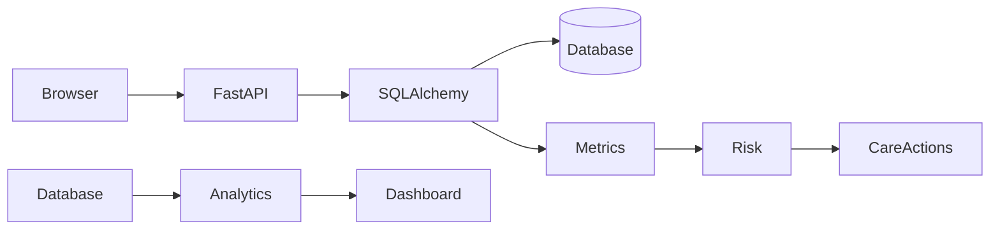

# Architecture

```mermaid
flowchart LR
  Browser --> FastAPI --> SQLAlchemy --> SQLiteOrPostgres[(Database)]
  SQLAlchemy --> Metrics --> Risk --> CareActions
  Database --> Analytics --> Dashboard
```

SQLite is the beginner demo database. PostgreSQL is the intended shared deployment database. The risk engine is deliberately rule-based and explainable.

